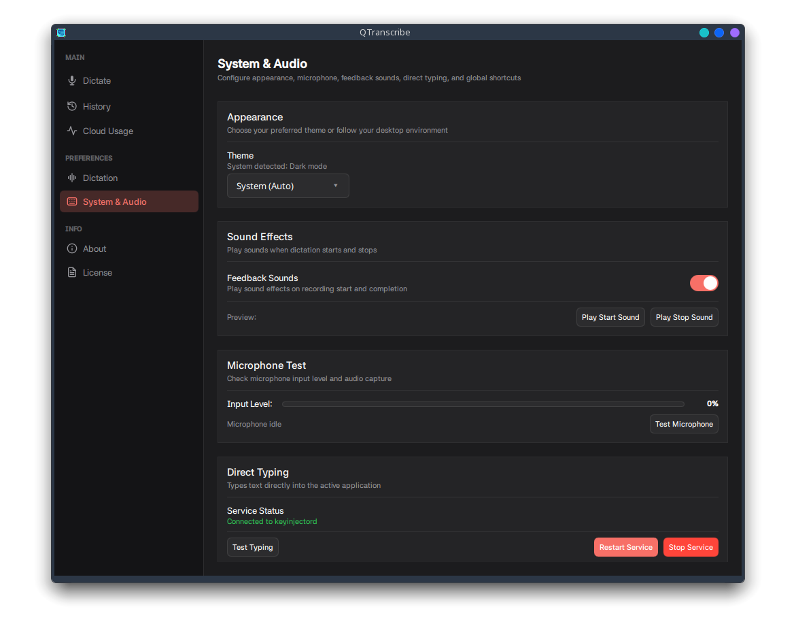

# QtScribe

Voice typing for Wayland. Press a shortcut, speak, and your words appear directly in the active input field.

Offline transcription runs locally on your device, keeping your audio private. You can also connect cloud providers like Groq or Google Gemini for fast online transcription.

> Free API keys:
> - Groq: [console.groq.com/keys](https://console.groq.com/keys)
> - Google Gemini: [aistudio.google.com/app/apikey](https://aistudio.google.com/app/apikey)

<p align="center">
  
</p>

---

## Screenshots

<p align="center">
  
  
</p>
<p align="center">
  
  
</p>
<p align="center">
  
  
</p>

---

## Features

- **Direct typing.** Types words straight into the focused input field of any app or browser without touching your clipboard.
- **Push-to-talk and toggle.** Hold a key to record and release to transcribe, or use toggle shortcuts.
- **Private and offline.** Runs speech models directly on your device. Audio never leaves your computer.
- **Hardware acceleration.** Runs local models on Vulkan-capable GPUs with automatic CPU fallback.
- **Cloud providers.** Connects to Groq or Google Gemini when you want cloud transcription.
- **Auto offline fallback.** Switches to your local model when the internet goes down, then back to cloud when the connection returns. No manual intervention needed.
- **System notifications.** Alerts you when recording limits are hit, the microphone disconnects, a model fails to load, or transcription errors occur.
- **Custom vocabulary.** Add specialized terminology, acronyms, and names to improve accuracy.
- **Language detection.** Detects spoken languages automatically or lets you pick a specific language.
- **Desktop shortcuts and tray.** Control recording with global shortcuts, system tray controls, or CLI commands.
- **Audio feedback.** Plays a chime when recording starts and finishes.
- **Secure credentials.** Stores API keys inside your system keyring (GNOME Keyring, KWallet, or Secret Service).

---

## Installation

Pre-built packages are attached to each [GitHub release](../../releases).

### Debian and Ubuntu (.deb)

```bash
sudo apt install ./qtscribe_*_amd64.deb
```

Installs binaries to `/usr/bin/qtscribe` and `/usr/bin/keyinjectord`, installs desktop files, and configures file capabilities on the helper daemon.

To uninstall:
```bash
sudo apt remove qtscribe
```

### Fedora and RHEL (.rpm)

```bash
sudo dnf install ./qtscribe-*.x86_64.rpm
```

To uninstall:
```bash
sudo dnf remove qtscribe
```

### Arch Linux (.pkg.tar.zst / AUR)

```bash
# Pre-built package
sudo pacman -U ./qtscribe-*-x86_64.pkg.tar.zst

# AUR
yay -S qtscribe
```

To uninstall:
```bash
sudo pacman -R qtscribe
```

---

## Desktop environment support and Wayland notes

For the best experience, use GNOME 48 or above, or KDE Plasma 6 and above. These environments support the global shortcuts portal natively, enabling push-to-talk dictation without manual shortcut configuration.

### Input injection and security

QtScribe cannot read, intercept, or log keystrokes. It only has write access to inject transcribed text through a helper daemon writing to `/dev/uinput`.

### Push-to-talk portal support

Push-to-talk mode requires the desktop compositor to implement the `org.freedesktop.portal.GlobalShortcuts` portal interface. The portal delivers press and release events, allowing the app to detect when a key is held down and released. On environments without this portal, dictation works via toggle mode using a custom shortcut mapped to `qtscribe --toggle`.

| Desktop environment | Status | Push-to-talk | Notes |
| :--- | :---: | :---: | :--- |
| **KDE Plasma 6** | Supported | Supported | Native KWallet integration, system Qt theming, and Klipper privacy flags |
| **GNOME 48+** | Supported | Supported | Uses GNOME Keyring and Secret Service |
| **GNOME 46** | Supported | Unsupported | Toggle mode only. Map a custom shortcut to `qtscribe --toggle` in Settings |
| **COSMIC** (System76) | Supported | Unsupported | Toggle mode only. Map a custom shortcut to `qtscribe --toggle` in Settings |
| **Hyprland** | Supported | Unsupported | Toggle mode only. Bind `qtscribe --toggle` in `hyprland.conf` |
| **Sway / wlroots** | Supported | Unsupported | Toggle mode only. Bind `qtscribe --toggle` in your compositor configuration |

---

## CLI options

The `qtscribe` binary supports command-line actions for scripting and window manager bindings:

| Option | Short | Description |
| :--- | :---: | :---: |
| `--toggle` | `-t` | Toggle recording state |
| `--start` | | Start recording |
| `--stop` | | Stop recording and transcribe |
| `--show` | `-s` | Focus and display the main window |
| `--quit` | `-q` | Terminate running instance |
| `--help` | `-h` | Print help message |
| `--version` | `-v` | Print application version |

---

## Usage

### 1. Configure speech engine
Open **Settings** in QtScribe:
- **Offline (default):** Download a speech model under **Offline Dictation**.
- **Cloud:** Select your provider (Groq or Google Gemini) under **Cloud Settings**, add your API key, and choose a model. Keys are saved securely in your system keyring.

### 2. Set shortcut
- **Plasma 6, GNOME 48+:** Approve the portal shortcut prompt on first start. Supports both toggle and push-to-talk.
- **COSMIC, GNOME 46, Hyprland, Sway:** Bind a custom keyboard shortcut to `qtscribe --toggle` in your desktop or compositor settings.

### 3. Dictate
- **Push-to-talk (Portal DEs):** Focus any input field, hold your shortcut, speak, and release.
- **Toggle mode:** Focus any input field, hit your shortcut, speak, and press it again to finish.

---

## Tips

- **Mouse bindings.** Bind `qtscribe --toggle` to an extra mouse button using `input-remapper` or Piper for toggle dictation.
- **Pre-injection delay.** If an application drops the first keystroke after switching focus, increase the delay slider in **System & Typing**.

---

## Troubleshooting

- **No text typed into target field:**
  - Verify the destination input field has active keyboard focus.
  - If using a local development build, ensure capabilities were granted: `sudo setcap cap_dac_override+ep build/keyinjectord`.
  - Run `qtscribe` in your terminal to view debug logs.
- **Push-to-talk does not work:**
  - Push-to-talk requires a desktop environment with `org.freedesktop.portal.GlobalShortcuts` (KDE Plasma 6, GNOME 48+). On GNOME 46, COSMIC, Hyprland, or Sway, use toggle mode with `qtscribe --toggle`.
- **Global shortcut does not fire on GNOME 46, Hyprland, or Sway:**
  - The desktop portal shortcut interface is not supported on these compositors. Add a native desktop shortcut that executes `qtscribe --toggle`.
- **Local model fails to load:**
  - Verify that the model download completed under `~/.local/share/qtscribe/models/`.
  - Check log output for Vulkan driver errors. If your GPU driver lacks compute support, inference falls back to CPU threads automatically.
- **Cloud API errors:**
  - Check your API key and network connection. Free tier keys are subject to provider rate limits.
- **Prompted for password on startup:**
  - This is expected. Your system asks for your password to unlock the keyring (GNOME Keyring or KWallet) so QtScribe can read stored API keys.
- **Keyring unlocked warning or errors:**
  - Ensure `gnome-keyring-daemon` or `kwalletd` is running and unlocked for your user session.
- **Clipboard contents overwritten:**
  - If `keyinjectord` cannot access `/dev/uinput`, QtScribe falls back to clipboard paste. Non-text data (such as image clips) cannot be restored after pasting. Ensure `keyinjectord` has proper capabilities set.

---

## Building from source

Qt 6.11.1 is required. Ubuntu 24.04 ships an older system Qt, so install Qt 6.11.1 from the Qt Online installer or with aqtinstall. CMake picks up `~/Qt/6.11.1/gcc_64` on its own. For a custom path, export `QT_DIR` or pass `-DCMAKE_PREFIX_PATH` when you configure.

Pinned third party versions are whisper.cpp v1.9.3 at commit `371b5a7` and QtKeychain 0.17.0 at commit `875f77d`. CMake fetches whisper.cpp for you. Packaging builds QtKeychain from source. Local builds can use the distro package instead.

### Prerequisites

Core tools are CMake 3.28 to 4.4, Ninja, a C++20 compiler (GCC 13 or newer, or Clang 17 or newer), and pkg-config.

Qt modules used are Gui, Qml, Quick, QuickControls2, Network, Multimedia, DBus, WaylandClient, and QuickEffects. The base Qt 6.11.1 install already contains them. You only need to add the Multimedia module when you install Qt with aqt.

System libraries cover Wayland protocols, secrets, input, audio, and clipboard fallback. Audio dev packages matter because QtMultimedia needs ALSA and Pulse headers at build time. `wl-clipboard` is a runtime dependency for clipboard fallback typing.

Ubuntu 24.04:

```bash
sudo apt-get install -y --no-install-recommends \
  ninja-build pkg-config libwayland-dev wayland-protocols \
  qtkeychain-qt6-dev libsecret-1-dev libevdev-dev libcap-dev \
  libxkbcommon-dev libgl1-mesa-dev libegl1-mesa-dev \
  libasound2-dev libpulse-dev wl-clipboard \
  libvulkan-dev glslc spirv-headers
```

Fedora 44:

```bash
sudo dnf install -y \
  ninja-build pkgconf wayland-devel wayland-protocols-devel \
  qt6-qtbase-devel qt6-qtdeclarative-devel qt6-qtmultimedia-devel \
  qt6-qtsvg-devel qt6-qtwayland qtkeychain-qt6-devel \
  libevdev-devel libcap-devel wl-clipboard \
  vulkan-loader-devel vulkan-headers glslc spirv-headers-devel
```

Arch:

```bash
sudo pacman -S --needed \
  cmake ninja gcc pkgconf wayland-protocols \
  qt6-base qt6-declarative qt6-multimedia qt6-svg qt6-wayland \
  qtkeychain-qt6 libevdev libcap wayland wl-clipboard \
  vulkan-headers vulkan-icd-loader shaderc spirv-headers
```

Optional lint tools are clang-format 22, `qmllint` and `qmlformat` from Qt 6, and pre-commit.

### 1. Configure

Configure once. Reconfigure when CMake files change.

```bash
cmake --preset linux-qt6-debug
```

Other presets exist for other output folders. Debug builds into `build/`. Release builds into `build-release/`. RelWithDebInfo builds into `build-relwithdebinfo/`. Sanitizer builds use `ci-sanitizer` for ASan and UBSan and `ci-sanitizer-tsan` for TSan.

```bash
cmake --preset linux-qt6-release
cmake --preset linux-qt6-relwithdebinfo
```

If Qt lives outside the default path, point CMake at it:

```bash
cmake --preset linux-qt6-debug -DCMAKE_PREFIX_PATH="$QT_DIR;/usr/lib/x86_64-linux-gnu"
```

#### Offline or air-gapped builds

CMake downloads whisper.cpp during configure. For a machine without network access, clone the pinned commit first and pass its path to CMake:

```bash
git clone https://github.com/ggml-org/whisper.cpp.git /opt/whisper-src
git -C /opt/whisper-src checkout 371b5a7561823ab2bb32142d2751e35e7534727b

cmake --preset linux-qt6-release \
  -DFETCHCONTENT_SOURCE_DIR_WHISPER=/opt/whisper-src \
  -DFETCHCONTENT_FULLY_DISCONNECTED=ON
```

### 2. Build

Build the full project:

```bash
cmake --build --preset build-debug
```

Build only the GUI when you work on QML or views:

```bash
cmake --build --preset build-debug --target qtscribe
```

Build only the helper daemon when you work on `src/keyinjectord/`:

```bash
cmake --build --preset build-debug --target keyinjectord
```

Release and RelWithDebInfo follow the same pattern with `build-release` and `build-relwithdebinfo`. Sanitizer builds use `ci-sanitizer` and `ci-sanitizer-tsan`.

Rebuild from scratch when build files look corrupt:

```bash
cmake --build --preset build-debug --clean-first
```

There is also a `ci-release` workflow preset that runs configure, build, test, and Debian packaging in one step.

### 3. Grant helper daemon capability

The daemon needs `cap_dac_override` to write to `/dev/uinput`. Grant it after each fresh build:

```bash
sudo setcap cap_dac_override+ep build/keyinjectord
```

Use `build-release/keyinjectord` or `build-relwithdebinfo/keyinjectord` when you build those presets.

### 4. Run tests and linting

Run the unit suite. The test preset sets `QT_QPA_PLATFORM=offscreen`, and CTest also sets `QT_MEDIA_BACKEND=null`, so tests run headless:

```bash
ctest --preset test-debug
```

Use `test-release`, `test-relwithdebinfo`, `ci-sanitizer`, or `ci-sanitizer-tsan` to match the build preset.

Check QML lint and AOT stats the same way CI does:

```bash
ninja -C build all_qmllint
cmake --build build --target all_aotstats
```

Run formatting and repo checks on all files:

```bash
pre-commit run --all-files
```

---

## Packaging

Packaging scripts live in [`packaging/`](packaging/) and need Docker Buildx. They read the version from `VERSION` when you skip the version args, and they write finished packages to `dist/`.

<details>
<summary><strong>Debian and Ubuntu (.deb)</strong></summary>

```bash
./packaging/deb/build-deb.sh 24.04 1.0.0
sudo apt install ./dist/deb/qtscribe_1.0.0_amd64.deb
```

Omit the args to build with defaults from `VERSION`:

```bash
./packaging/deb/build-deb.sh
```
</details>

<details>
<summary><strong>Fedora and RHEL RPM (.rpm)</strong></summary>

```bash
./packaging/rpm/build-rpm.sh 44 1.0.0 1
sudo dnf install ./dist/rpm/qtscribe-1.0.0-1.fc44.x86_64.rpm
```

Omit the args to build with defaults from `VERSION`:

```bash
./packaging/rpm/build-rpm.sh
```
</details>

<details>
<summary><strong>Arch Linux (.pkg.tar.zst)</strong></summary>

```bash
./packaging/arch/build-arch.sh 1.0.0 1
sudo pacman -U ./dist/arch/qtscribe-1.0.0-1-x86_64.pkg.tar.zst
```

Omit the args to build with defaults from `VERSION`:

```bash
./packaging/arch/build-arch.sh
```
</details>

### Verifying release artifacts

Each release attaches SLSA build provenance, a CycloneDX SBOM (`bom.json`), a `SHA256SUMS.txt` checksum file, and keyless Sigstore bundles (`*.sigstore.json`) for every package.

```bash
# 1. Verify checksums
sha256sum -c SHA256SUMS.txt

# 2. Verify SLSA provenance / SBOM attestation (requires gh)
gh attestation verify ./qtscribe_<version>_amd64.deb -R Vidhan31/qtscribe

# 3. Verify publisher signature bundle (requires cosign)
cosign verify-blob \
  --bundle ./qtscribe_<version>_amd64.deb.sigstore.json \
  --certificate-identity-regexp 'https://github.com/Vidhan31/qtscribe.*' \
  --certificate-oidc-issuer https://token.actions.githubusercontent.com \
  ./qtscribe_<version>_amd64.deb
```
